# Alchemytics - Infra

В данном репозитории будет храниться основная информация по тому, что представляет из себя инфраструктура проекта Alchemytics, а также все необходимые инструкции для управления приложениями и сервисами

1. [Основные сервисы](#основные-сервисы)

# Основные сервисы

Целевая структура сервисов состоит из следующих компонент:

- **website** - основной вебсайт проекта (https://alchemytics.ru), который может существовать отдельно от остального проекта и по сути представляет собой MPA (Multi Page Application) реализацию блога

Визуально сервисы связаны между собой следующим образом

```mermaid
architecture-beta
    group alchemytics[Alchemytics Project]

    service website(mdi:web)[website] in alchemytics
```

